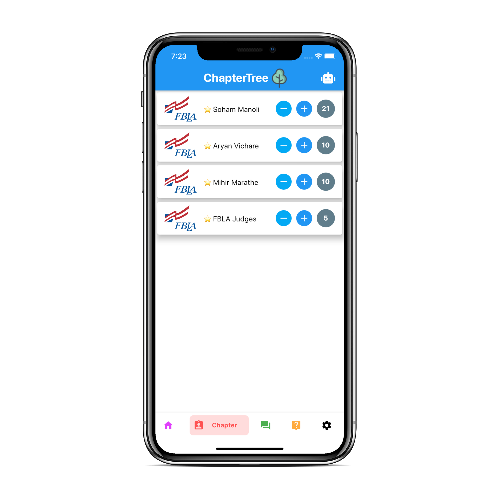
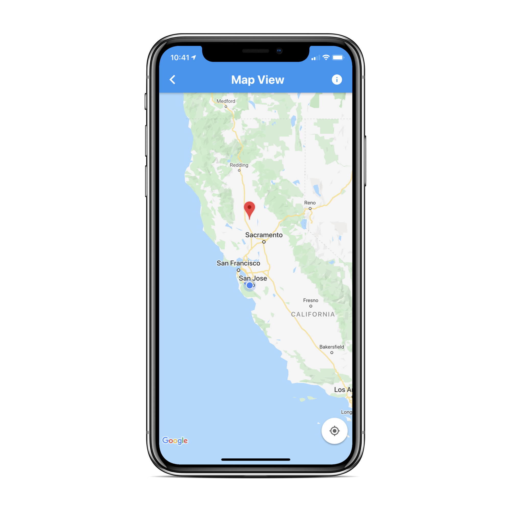
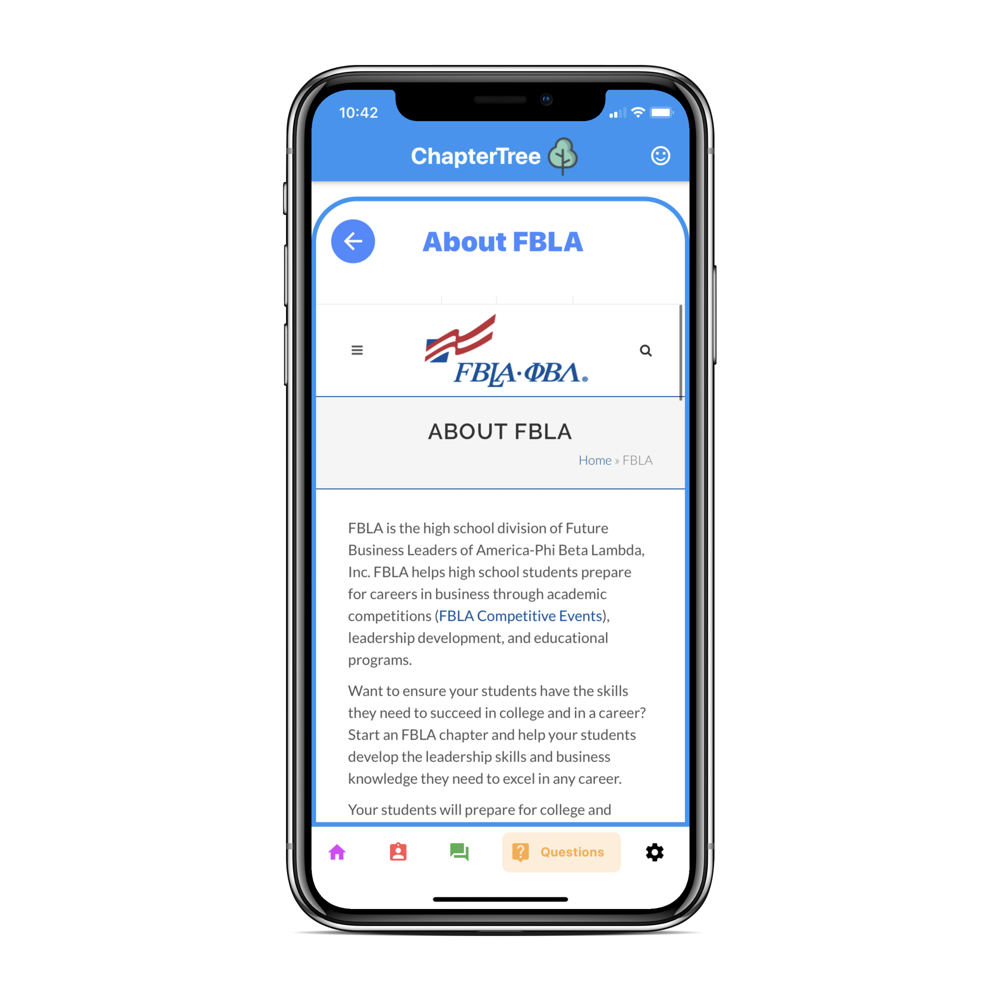
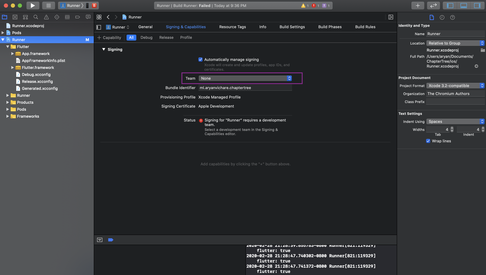
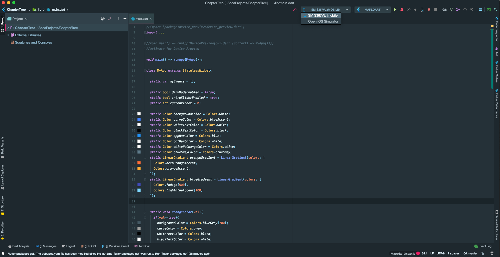

# ChapterTree

FHS Mobile App Development
 
Date of submission: 2/28/20

# Overview  
Welcome to ChapterTree, an amazing app that allows you to seamlessly manage your chapters! ChapterTree is designed to provide users with a platform to record event information, track chapter attendance, communicate with other FBLA members, talk with our intelligent ChatBot, and learn more about FBLA. Additionally, the app implements API's that enhance the user experience by communicating with our database, implementing google maps, and providing a real time data flow that dynamically updates information that the user needs.  

This application was programmed completely in Google's Flutter Framework.

# Portfolio
  

# Brainstorming and Planning
- [App Design Flow](https://docs.google.com/document/d/1HiQpNK7N295IVqAyzwiOjUOHYOlEwiSwyGvqaZ7WNi0/edit)
- [App Brainstorm](https://docs.google.com/document/d/1ZdlabqNYcHull3JlMOZ7KsLOXtSgzFny4yDk9xCPQ4U/edit)
- [Youtube](https://www.youtube.com/channel/UCt45kKvhf02NO_vPSu0RsZQ/featured)

# Core Features 
- Native performance on both iOS and Android 
- Fully responsive and adaptable UI to any screen dimensions 
- Robust backend for Authentication, Cloud database, Cloud Storage
  - Built-in encryption on database for user passwords
- Email/Password and Face ID login for extensive accessibility 
- Google sign-in for convenience and accessibility
- Beautiful dashboard to view, sign-up, remove local and national events
  - Harnesses the power of cloud data persistence 
- Social Media Integration to share on many platforms such as Facebook, Twitter, Messenger, Messages, and much more!
- Dynamic calendar to add events seamlessly 
  - Only chapter leaders can track attendance 
- Google Maps API integration to view user's location event destination through markers
- Google Maps Distance Matrix API integration to view driving distance and time needed to reach event 
  - Utilizes Machine Learning on historical traffic data, weather conditions, and more to provide precise metrics 
- Built-in navigator to view directions in Google Maps 
- Seamless integration for meeting attendance
  - Only chapter leaders can track attendance 
  - Employs cloud data persistence
- Embedded Web Viewers to learn more about FBLA
- Global Messaging FBLA Portal 
  - Users can ask questions, learn more about FBLA, and much more
  - Powered by Cloud Storage Streaming 
- Smart Assistance AI Powered FBLA Chatbot 
  - Answers all questions pertaining to FBLA (e.g. what is the dress code for FBLA?)
  - Powered on Google's Neural Networks that perform Natural Language Processing (NLP)
- Contact us form
  - Integrated with Gmail API to send email directly to ChapterTree's gmail account
- Settings page for viewing user profile
- Dark mode 
- Officer SMS notification 
  - Seamless way to send meeting reminder notifications to all chapter members in a single click
- Smart Analytics and data aggregation on user metrics such as User Retention
  
# Getting Started
  The following are the most effective methods to run ChapterTree on your device.
  
  #### IPhone and IPad (IOS): 
  1. Download XCode from the Mac OS App Store.
  2. Create a free account on the Apple Developer Portal.
  3. Once you are signed in, consult the Xcode Deployment Section below.
   
  Prerequisites
  > Device with IOS 9.0 or above (Emulator Works!)
  > - Note : If you have IOS 13.31 or above, you cannot run the app with a free developer account!
  #### Android Phone and Tablet (Android): 
  1. Download Intellij from https://www.jetbrains.com/idea/.
  2. To install the Flutter Plugin:
  - Start Android Studio.
  - Open plugin preferences (Preferences > Plugins on macOS, File > Settings > Plugins on Windows & Linux).
  - Select Marketplace, select the Flutter plugin and click Install.
  - Click Yes when prompted to install the Dart plugin.
  - Click Restart when prompted.
  
  Once you are set up in, consult the IntelliJ Deployment Section below.
   
  Prerequisites
  > Device with Android SDK 20 to 28 (Emulator Works!)

# Xcode Deployment
1. Open up the folder where ChapterTree is downloaded and open up `Runner.xcworkspace`

2. Right when you open up `Runner.xcworkspace` you may get an error regarding `Signing and Capabilities`

3. To fix this, go to the tab `Signing and Capabilities` and select a team. The error should go away after this. 

4. You can now view all the iOS code project files and dependencies

5. To run the app, connect a lighting cable from your computer to your phone. You should see your device show up as shown below:

6. After the application opens and the Build Succeeds you will be prompted to the login screen
7. Login with the credentials: 
* email: `judges@gmail.com`  
* password: `fbla123`
* Note: These credentials have special privileges as a chapter leader such as taking attendence and adding events to the calendar 
 
9. Feel free to explore the app and refer to our `Core Features` for the full list of our app's functionalities
10. If you experience a bug in the app, feel free to `Report a Bug` under the `Questions` tab of our app. 

  
# IntelliJ Deployment
 1. Open the unzipped project in IntelliJ
 2. Configure the Dart SDK
 3. Open the project.
  
 4. Click on `packages get` or run `flutter packages get` in the terminal.
  
 5. Make sure you configure any Android Frameworks if neccessary.
  
 6. Go to the `devices` tab and make sure your device is selected.
  
 7. Click on the green button and `run` the app.
 8. You should see `Running Gradle task 'assembleDebug'`.
 
  

  
# Technologies and API's used

- [GitHub](http://github.com)
- [flutter_sms](https://pub.dev/packages/flutter_sms)
- [http](https://pub.dev/packages/http)
- [permission](https://pub.dev/packages/permission)
- [google_map_polyline](https://pub.dev/packages/google_map_polyline)
- [shared_preferences](https://pub.dev/packages/shared_preferences)
- [table_calendar](https://pub.dev/packages/table_calendar)
- [location](https://pub.dev/packages/location)
- [geolocator](https://pub.dev/packages/geolocator)
- [intro_slider](https://pub.dev/packages/intro_slider)
- [local_auth](https://pub.dev/packages/local_auth)
- [flutter_dialogflow](https://pub.dev/packages/flutter_dialogflow)
- [google_maps_flutter](https://pub.dev/packages/google_maps_flutter)
- [google_sign_in](https://pub.dev/packages/google_sign_in)
- [webview_flutter](https://pub.dev/packages/webview_flutter)
- [flutter_icons](https://pub.dev/packages/flutter_icons)
- [url_launcher](https://pub.dev/packages/url_launcher)
- [flutter_email_sender](https://pub.dev/packages/flutter_email_sender)
- [modal_progress_hud](https://pub.dev/packages/modal_progress_hud)
- [cloud_firestore](https://pub.dev/packages/cloud_firestore)
- [firebase_auth](https://pub.dev/packages/firebase_auth)
- [firebase_core](https://pub.dev/packages/firebase_core)
- [animated_text_kit](https://pub.dev/packages/animated_text_kit)
- [snaplist](https://pub.dev/packages/snaplist)
- [giffy_dialog](https://pub.dev/packages/giffy_dialog)
- [flappy_search_bar](https://pub.dev/packages/flappy_search_bar)
- [Firebase Authentication](https://firebase.google.com/products/auth)
- [Firebase Cloud Firestore](https://firebase.google.com/products/firestore)
- [Firebase Cloud Storage](https://firebase.google.com/products/storage)
- [Firebase Crashlytics](https://firebase.google.com/products/crashlytics)
- [Firebase Performance Monitoring](https://firebase.google.com/products/performance)
- [Google Analytics](https://analytics.google.com/)

# License 
  ChapterTree is licensed under the MIT License - Please view [LICENCE](https://github.com/msoham123/ChapterTree/blob/master/LICENSE) for more details

# Copyright Information
* Login and Signup user authentication powered by Firebase and consistent with their API usage policies
* Facebook Logo used for application graphics with explicit permission from Facebook Brand Resources.
* Twitter Logo used for application graphics with explicit permission from Twitter Brand Resources.
* Instagram Logo used for application graphics with explicit permission from Twitter Brand Resources.
* Google logo used for application graphics in accordance with [Google Trademark Policy](https://www.google.com/permissions/trademark/rules.html).
* The App Store, Xcode, iPad, iPhone, and IOS are all registered trademarks of Apple Inc.
* The following image acknowledgements are in accordance with the Google Images [copyright policy](https://support.google.com/websearch/answer/29508?hl=en).
  - "Colusa" image from Google
  - "Los Osos" image from Google
  - "Ontario" image from Google
  - "Pasadena" image from Google
  - "Redwood" image from Google
  - "SaltLakeCity" image from Google
  - "Valencia" image from Google
  - "Westmoor" image from Google
  - "TreeIcon" image from Google
* The following image acknowledgements are in accordance with the Undraw [license](https://undraw.co/license).
  - "Attendance" image from Undraw
  - "Calendar" image from Undraw
  - "Events" image from Undraw
  - "Map" image from Undraw
  - "Messages" image from Undraw
  

# Developers 
* Aryan Vichare - <i>User Interface (UI), Backend, Database, API integration</i>
* Soham Manoli - <i>User Interface (UI), User Experience (UX), API integration</i>

