# Connectify

Fremont High School Mobile App Development
 
Date of submission: 2/24/21

# Overview
Welcome to Connectify, an amazing app that allows you to seamlessly connect and network with other students! Connectify is designed to provide users with a platform to post about their hobbies and proffesional interests, create and explore a myriad of innovative and fresh startups, chat with people looking to network, build a expansive portfolio, and gives them the ability to find other likeminded individuals. 

Additionally, Connectify implements several API's that enhance the user experience, such as the Google Authentication API, Cloud Firestore API, Dropbox API, and more! With the power of our speedy database and the cloud, Connectify provides a real time data flow that dynamically updates information that the user needs, allowing them to interact with other users efficiently. 

# Portfolio
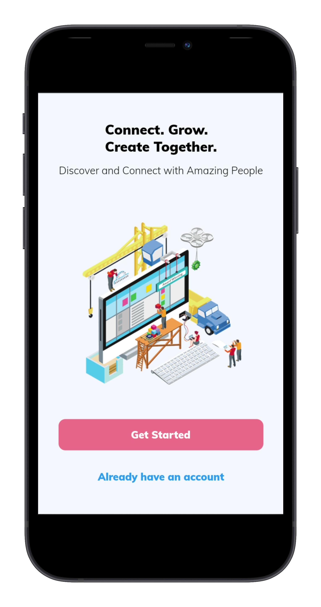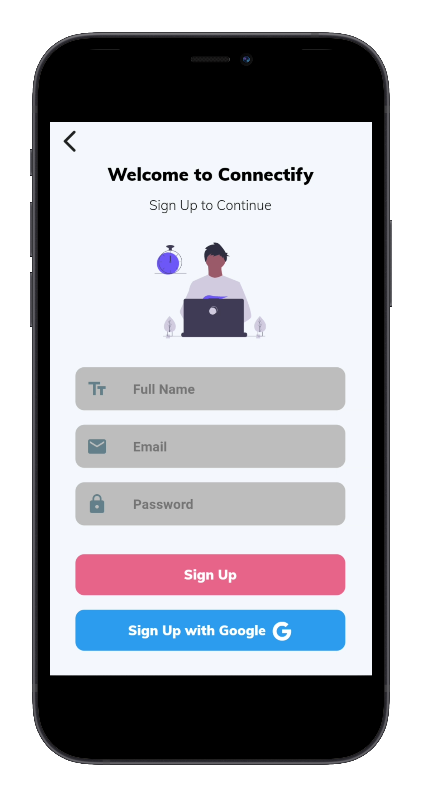 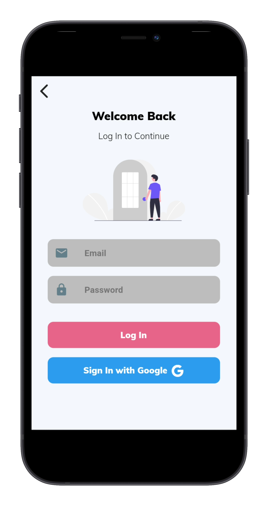
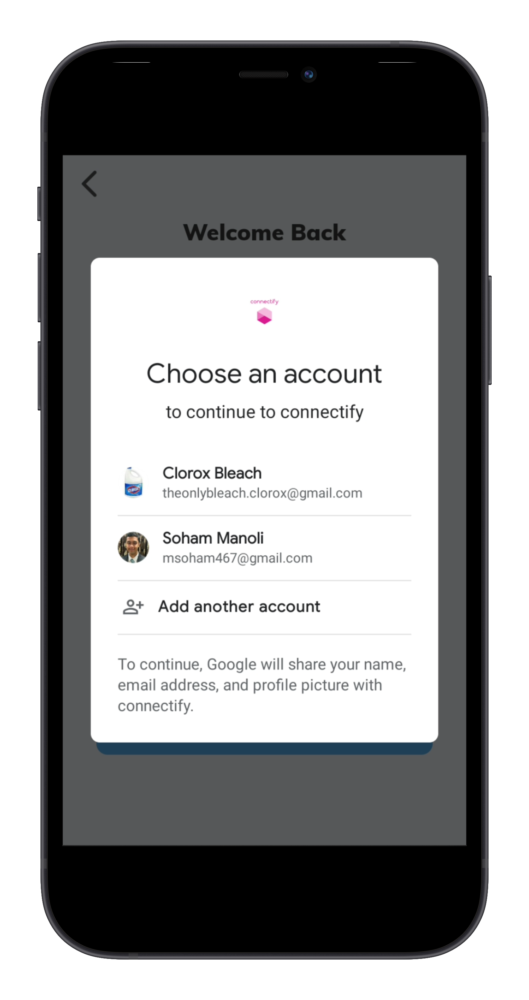 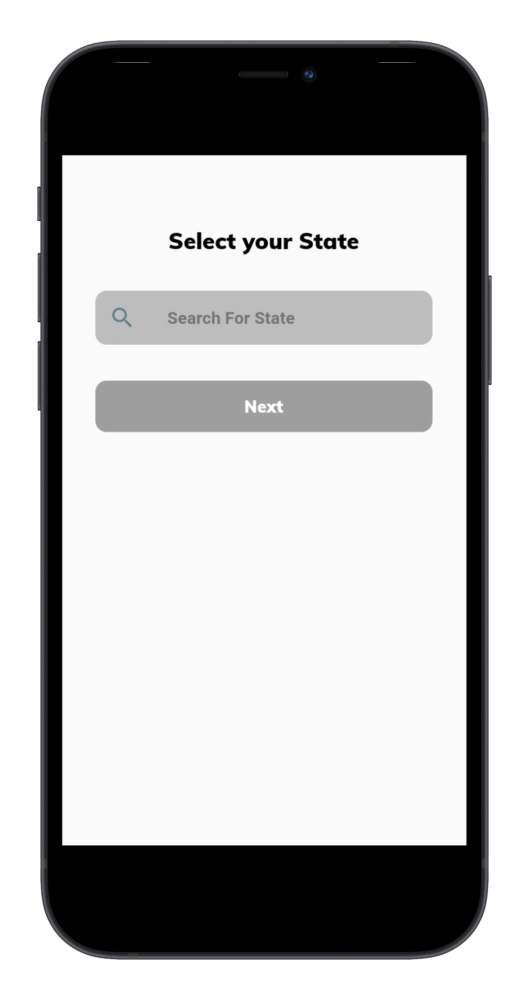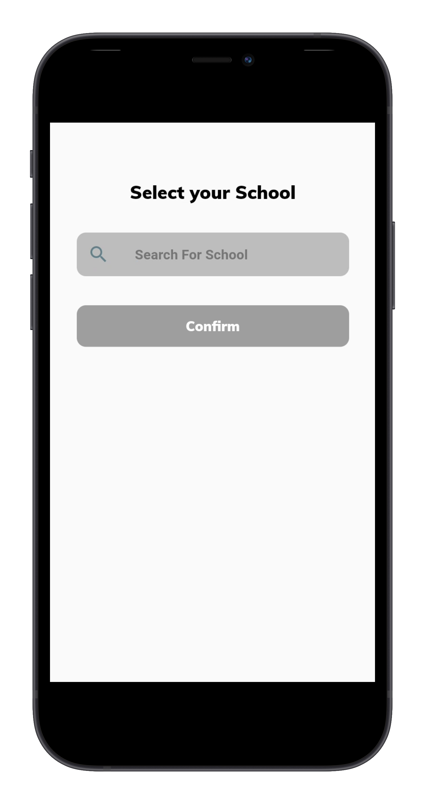
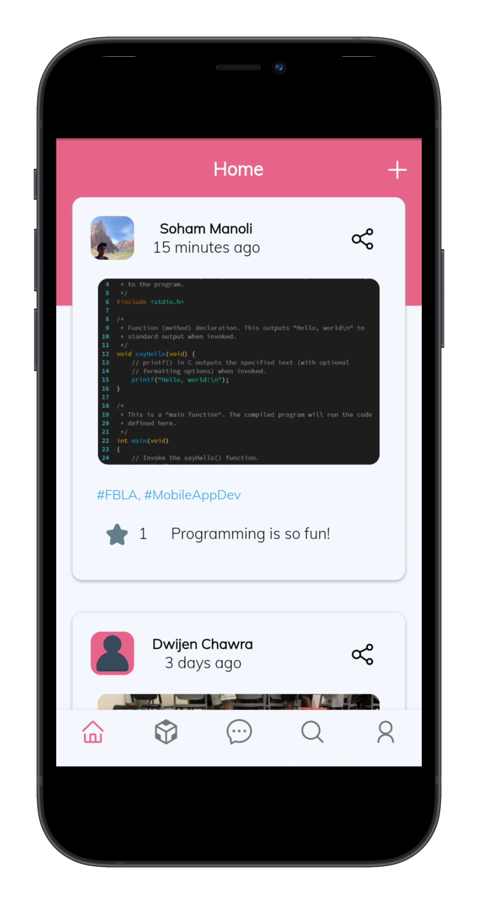
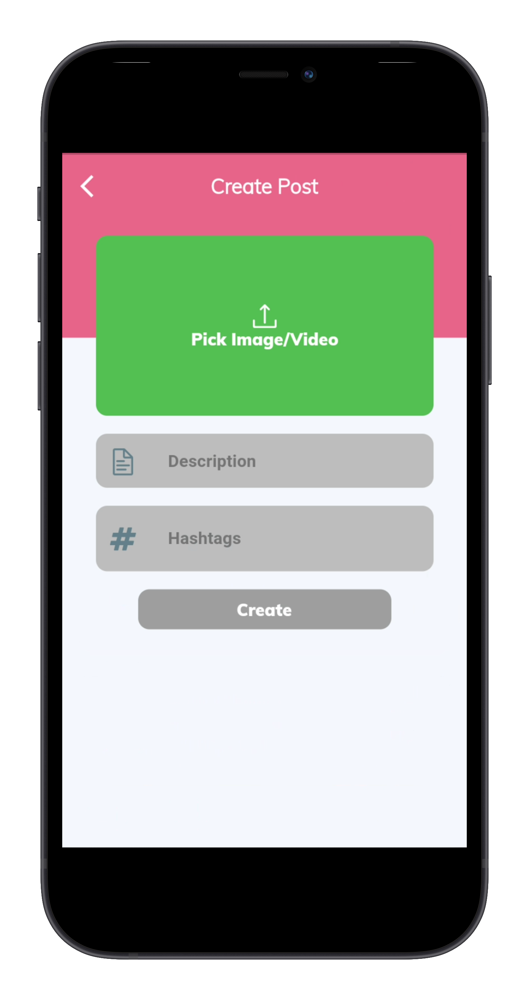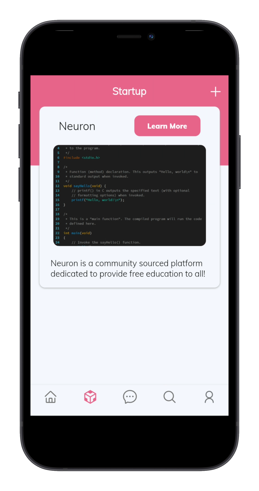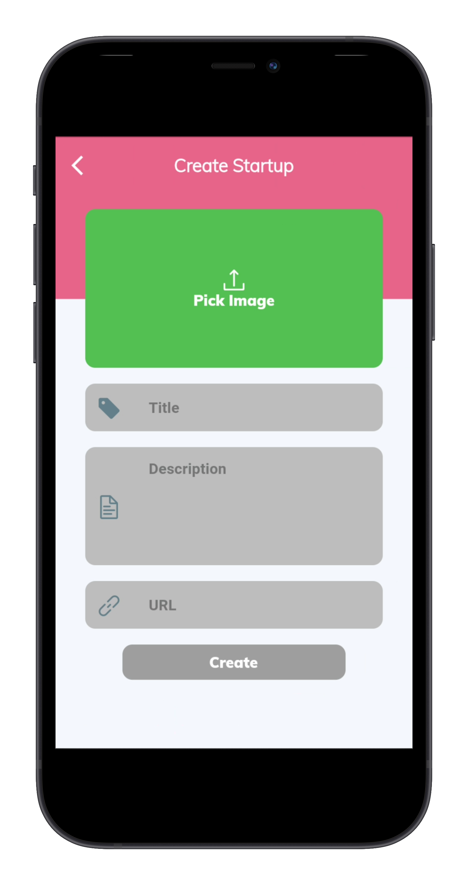
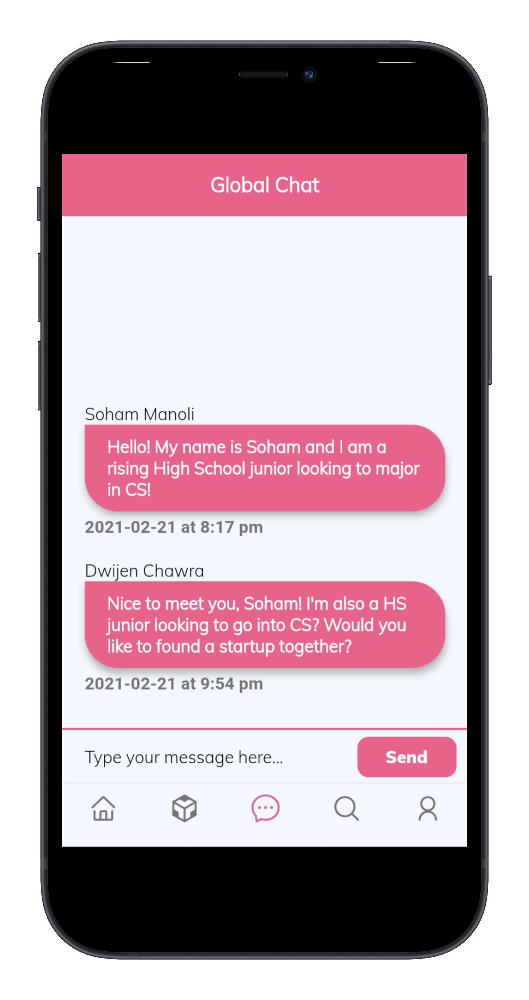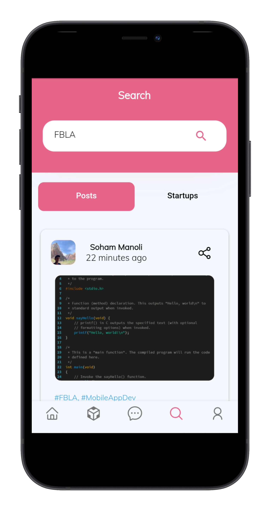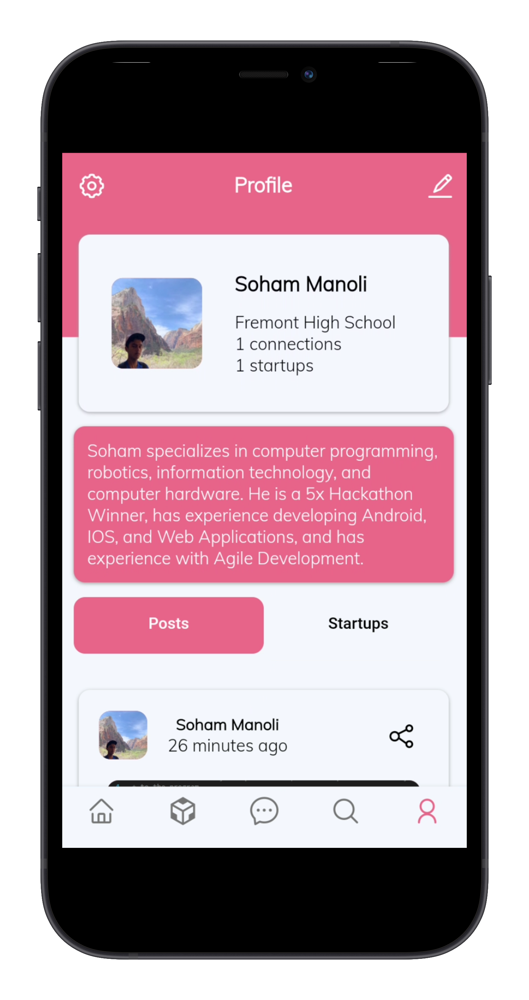
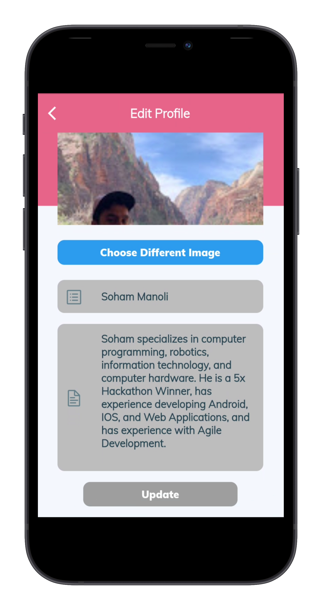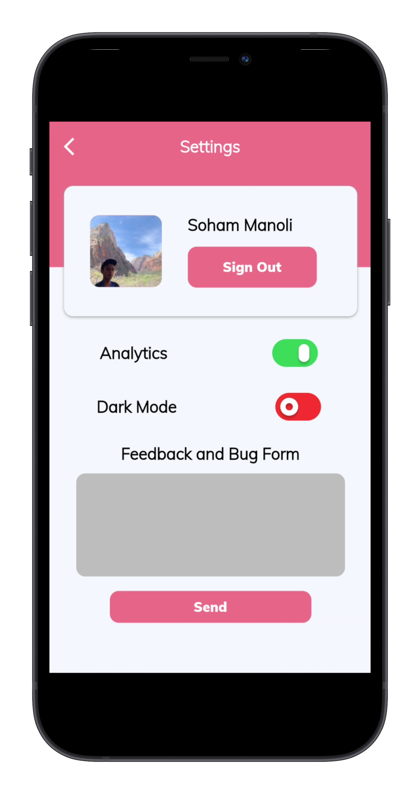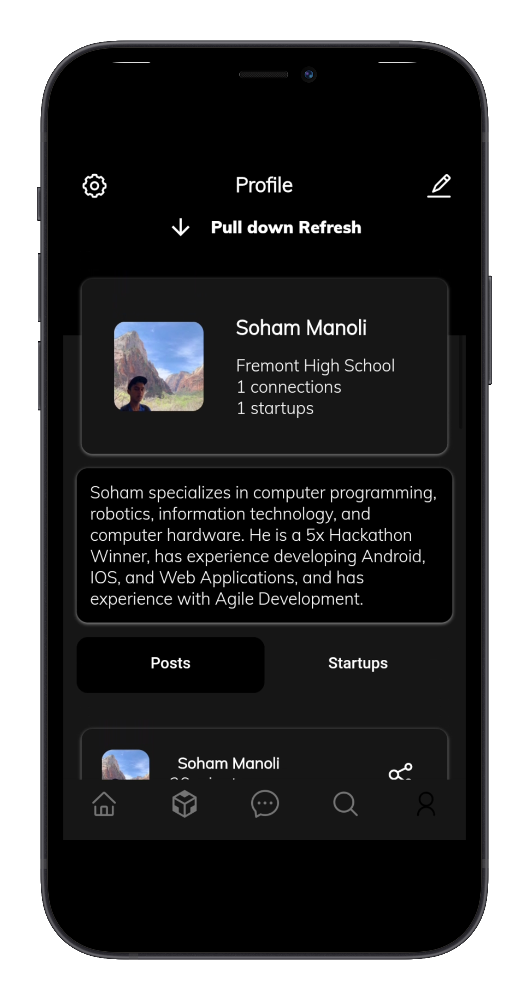
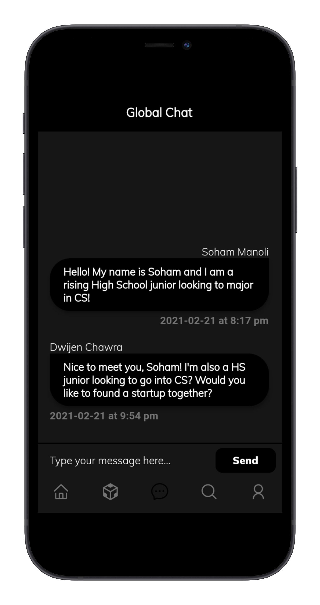

# Brainstorming and Planning
- As developers, we wanted to ensure that we developed Connectify with the utmost efficiency, precision, and industry leading practices. With this in mind, we decided to go with the Agile Development Flow.

- In order to manage our development flow, we used Jira, Project Management Software, where we can utilize the full power of Agile Development through sprints, stories, and epics.
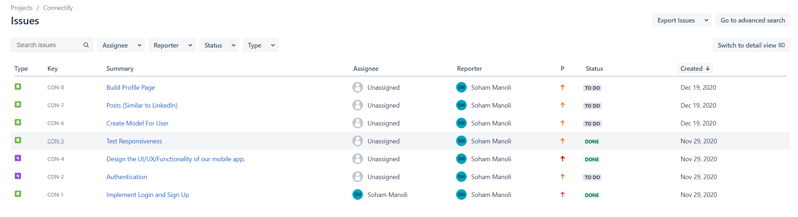

- Additionally, we used Whimsical and the power of flowcharts to map out the navigation and flow of our application. Here is the [link](https://whimsical.com/connectify-ui-XNmngw3TDiF2i3nm9hPaLx) to the flowchart.

- Finally, to actual brainstorm the main idea of the application, we created a Google Document and brainstormed our ideas there. Here is the [link](https://docs.google.com/document/d/1ii7XncCHN1d70GkPUmBKxlCEMe5Ol3ltzwQC9ng-e8M/edit?usp=sharing) to the brainstorm document.

# Core Features

Performance
 
- Native performance on both iOS and Android
- Fully responsive and adaptable UI to any screen dimensions, including tablets
- Robust backend for Authentication 
    - Built-in encryption on database for user passwords (UUID, Firebase)
- Email/Password login for extensive accessibility with Firebase Authentication
- Google sign-in for convenience and accessibility (OAuth, Google Cloud API)
- Powerful cloud database with Cloud Firestore
    - Secure, speedy, and reliable
- High Bandwith and Quality Cloud Storage with Dropbox API
    - Fast video streams, image storage

Application
- Seamless Setup Process
    - Autofill completion for state and school information
    - Intro slider screen to guide the user
- Dynamic feed that fetches posts using the power of the cloud
    - Tracks information such as date published, relevance, etc.
- Algorithm loads post from your school or related schools
    - Utilizes Machine Learning on School Object data, such as proximity, type of school
- Social Media Integration to share on many platforms such as Facebook, Twitter, Messenger, Messages, and much more! (Must have correlated apps installed for integration)
- Seamless integration for creating a post
    - Post is added to our database
    - Employs cloud data persistence
    - Error handling incase the upload cannot be performed
- An innovative solution to create and explore startups
    - Embedded Web Viewers to learn more about the startup
    - Image to promote branding and convey central purpose of startup
    - Description to provide context and overview of startup
- Seamless integration for creating a startup
    - Startup is added to our database
    - Employs cloud data persistence
    - Error handling incase the upload cannot be performed
- Global Messaging Networking Portal
    - Users can ask questions, learn more about subject areas, and network with other likeminded students
    - Powered by Cloud Storage Streaming
- Smart Cloud-Powered Search Engine
    - Finds posts and startups based on the entry query
    - Designed around the query networking model  (OSI Model)
- Beautiful Profile Page that allows the user to view detailed and impressive portfolios
    - The profile image, name, and description can all be changed
    - You can also view other people's portfolios by clicking on their image
    - Integrated with Google Auth to automatically create account with Google information if you use a Google Sign In
- Easy to Access Settings Page
    - Straightforward signing out process
    - Simple toggle for dark mode, which reduces energy usage and is better for the eyes in a dark room
    - Disable analytics option, as we believe that it is the right of the user to decide how and where their data is used
- Feedback and Bug Report Form in the Settings Page
    - Allows user to request new features as well as report bugs so we can make the Connectify experience as flawless as possible
- Blazing Fast Local Database Using Hive
    - Stores login information and dark mode preferences so the user does not have to sign in or enable dark mode every time they open Connectify
- Smart Analytics and data aggregation on user metrics such as User Retention, Device Info, etc.

# Technologies and API's used

- [Flutter](https://flutter.dev/)
- [Dart](https://dart.dev/)
- [Google Cloud Platform](https://cloud.google.com/)
- [Dropbox API](https://www.dropbox.com/developers)
- [Firebase Authentication](https://firebase.google.com/products/auth)
- [Firebase Cloud Firestore](https://firebase.google.com/products/firestore)
- [Firebase Cloud Storage](https://firebase.google.com/products/storage)
- [Firebase Cloud Functions](https://firebase.google.com/products/functions)
- [Firebase Crashlytics](https://firebase.google.com/products/crashlytics)
- [Firebase Performance Monitoring](https://firebase.google.com/products/performance)
- [Google Analytics](https://analytics.google.com/)
- [flutter_sms](https://pub.dev/packages/flutter_sms)
- [http](https://pub.dev/packages/http)
- [flutter_svg](https://pub.dev/packages/flutter_svg)
- [hive](https://pub.dev/packages/hive)
- [provider](https://pub.dev/packages/provider)
- [custom_navigation_bar](https://pub.dev/packages/custom_navigation_bar)
- [introduction_screen](https://pub.dev/packages/introduction_screen)
- [material_dialogs](https://pub.dev/packages/material_dialogs)
- [modal_progress_hud](https://pub.dev/packages/modal_progress_hud)
- [flutter_typeahead](https://pub.dev/packages/flutter_typeahead)
- [google_sign_in](https://pub.dev/packages/google_sign_in)
- [animations](https://pub.dev/packages/animations)
- [pull_to_refresh](https://pub.dev/packages/pull_to_refresh)
- [url_launcher](https://pub.dev/packages/url_launcher)
- [dropbox_client](https://pub.dev/packages/dropbox_client)
- [path_provider](https://pub.dev/packages/path_provider)
- [cloud_firestore](https://pub.dev/packages/cloud_firestore)
- [firebase_auth](https://pub.dev/packages/firebase_auth)
- [firebase_core](https://pub.dev/packages/firebase_core)
- [file_picker](https://pub.dev/packages/file_picker)
- [uuid](https://pub.dev/packages/uuid)
- [image_picker](https://pub.dev/packages/image_picker)
- [better_player](https://pub.dev/packages/better_player)
- [tab_indicator_styler](https://pub.dev/packages/tab_indicator_styler)
- [device_info](https://pub.dev/packages/device_info)
- [xlive_switch](https://pub.dev/packages/xlive_switch)
- [hive_flutter](https://pub.dev/packages/hive_flutter)
- [share](https://pub.dev/packages/share)
- [hive_flutter](https://pub.dev/packages/hive_flutter)

This application was programmed completely in Google's Flutter Framework.

# License
Connectify is licensed under the MIT License - Open the LICENSE for more details

# Copyright Information
* Login and Signup user authentication powered by Firebase and consistent with their API usage policies
* Cloud Storage powered by Dropbox and consistent with their API usage policies
* Facebook Logo used for application graphics with explicit permission from Facebook Brand Resources.
* Twitter Logo used for application graphics with explicit permission from Twitter Brand Resources.
* Instagram Logo used for application graphics with explicit permission from Twitter Brand Resources.
* Google logo used for application graphics in accordance with [Google Trademark Policy](https://www.google.com/permissions/trademark/rules.html).
* The App Store, Xcode, iPad, iPhone, and IOS are all registered trademarks of Apple Inc.
* The following image acknowledgements are in accordance with the Undraw [license](https://undraw.co/license).
    - "Landing" image from Undraw
    - "Login" image from Undraw
    - "Signup" image from Undraw
    - "Skills" image from Undraw
    - "Portfolio" image from Undraw
    - "Chat" image from Undraw
* All other images or media belongs to Connectify or is uploaded by users at their own risk to the platform 

# Developers
* Soham Manoli - <i>User Interface (UI), Backend, Database, API integration, Server Side Code, Android Configuration</i>
* Aryan Vichare - <i>User Interface (UI), User Experience (UX), User Testing, IOS Configuration</i>

